# API Serverless con Autenticación JWT

API serverless en AWS que implementa un sistema de autenticación JWT con generación de tokens y autorización personalizada. La arquitectura utiliza API Gateway para el enrutamiento de peticiones, Lambda Functions para la lógica de negocio, y está definida como infraestructura como código usando AWS SAM.

## 🌟 Características Principales

### Sistema de Autenticación
- Autenticación basada en JWT con sistema de refresh tokens
- Tokens de acceso de corta duración (1 hora)
- Tokens de refresco de larga duración (7 días)
- Validación automática de tokens en cada petición

### Seguridad
- Autorización personalizada para API Gateway
- Gestión segura de secretos con SSM Parameter Store
- Políticas IAM mínimas necesarias por función
- Validación de claims en tokens

### DevOps
- Pipeline de CI/CD completo con GitHub Actions
- Despliegue automatizado por ambiente (dev/staging/prod)
- Validaciones automáticas de infraestructura
- Rollback automático en caso de fallo

### Observabilidad
- Trazabilidad completa con AWS X-Ray
- Logs estructurados con AWS Lambda Powertools
- Métricas detalladas en CloudWatch
- Monitoreo de performance y errores

### Infraestructura
- Arquitectura serverless escalable
- Soporte completo para CORS
- Gestión de dependencias con Lambda Layers
- Configuración flexible por ambiente

## 📋 Estructura del Proyecto

```
.
├── .github/
│   └── workflows/
│       └── deploy-lambda.yml    # Pipeline de CI/CD con GitHub Actions
├── layers/
│   ├── python/                  # Dependencias compartidas para todas las funciones
│   │   ├── jwt/                # Librería para manejo de JWT
│   │   ├── powertools/         # AWS Lambda Powertools
│   │   └── ...                 # Otras dependencias
│   └── requirements.txt         # Definición de dependencias Python
├── src/
│   ├── authorizer/             # Función de autorización JWT
│   │   ├── app.py             # Lógica de validación de tokens
│   │   └── utils/             # Utilidades de autorización
│   └── token_generator/        # Generador de tokens JWT
│       ├── app.py             # Lógica de generación de tokens
│       └── utils/             # Utilidades de generación
├── template.yaml              # Definición de infraestructura SAM
└── README.md                 # Documentación del proyecto
```

### Descripción de Componentes

#### 1. Workflow CI/CD (.github/workflows/deploy-lambda.yml)
- Pipeline automatizado de integración y despliegue
- Validaciones de código y estructura
- Construcción de layers y funciones
- Despliegue por ambiente

#### 2. Lambda Layer (layers/)
- Capa compartida de dependencias
- Optimización de tamaño de funciones
- Reutilización de código común
- Gestión centralizada de versiones

#### 3. Funciones Lambda (src/)
- Código fuente de las funciones
- Separación clara de responsabilidades
- Utilidades compartidas
- Tests unitarios y de integración

#### 4. Infraestructura (template.yaml)
- Definición de recursos AWS
- Configuración de API Gateway
- Políticas IAM y permisos
- Variables de ambiente y parámetros

## 🔧 Configuración

### Pre-requisitos Detallados

1. AWS CLI
```bash
# Instalar AWS CLI
curl "https://awscli.amazonaws.com/awscli-exe-linux-x86_64.zip" -o "awscliv2.zip"
unzip awscliv2.zip
sudo ./aws/install

# Configurar credenciales
aws configure
```

2. AWS SAM CLI
```bash
# Instalar SAM CLI
pip install aws-sam-cli

# Verificar instalación
sam --version
```

3. Python 3.11
```bash
# Instalar Python 3.11
sudo apt update
sudo apt install python3.11 python3.11-venv

# Crear entorno virtual
python3.11 -m venv .venv
source .venv/bin/activate
```

4. Git
```bash
# Instalar Git
sudo apt-get install git

# Configurar Git
git config --global user.name "Tu Nombre"
git config --global user.email "tu@email.com"
```

### Variables de Entorno

#### Secretos de GitHub
Configurar en: Settings > Secrets > Actions

1. AWS_ACCESS_KEY_ID
- Descripción: Access Key para AWS
- Requerido: Sí
- Formato: String (20 caracteres)

2. AWS_SECRET_ACCESS_KEY
- Descripción: Secret Key para AWS
- Requerido: Sí
- Formato: String (40 caracteres)

3. AWS_REGION
- Descripción: Región de AWS
- Requerido: Sí
- Ejemplo: us-east-1

4. AUTH_TOKEN_SECRET
- Descripción: Secreto para firmar JWT
- Requerido: Sí
- Mínimo: 6 caracteres
- Recomendado: 32+ caracteres aleatorios

### Parámetros SSM

#### Parámetros del Sistema

1. /auth/token/time
```yaml
Type: String
Value: '3600'
Description: Tiempo de expiración del token en segundos
Tier: Standard
DataType: text
```

#### Acceso en Código
```python
from utils.ssm.parameter import get_parameter

# Obtener tiempo de expiración
token_time = int(get_parameter('/auth/token/time'))

# Usar en generación de token
expiration = datetime.utcnow() + timedelta(seconds=token_time)
```

## 🚀 Despliegue

### GitHub Actions Workflow

#### Triggers
1. Push a main
```yaml
on:
  push:
    branches: [main]
    paths:
      - 'src/**'
      - 'layers/**'
      - 'template.yaml'
```

2. Pull Request
```yaml
on:
  pull_request:
    branches: [main]
    paths:
      - 'src/**'
      - 'layers/**'
      - 'template.yaml'
```

3. Release
```yaml
on:
  release:
    types: [created]
```

4. Manual
```yaml
on:
  workflow_dispatch:
    inputs:
      environment:
        description: 'Environment to deploy to'
        required: true
        default: 'dev'
        type: choice
        options:
          - dev
          - staging
          - prod
```

#### Proceso de Despliegue

1. Verificación de Estructura
```yaml
- name: Verify Project Structure
  run: |
    echo "Verificando estructura del proyecto..."
    if [ ! -d "layers" ]; then
      echo "Error: Directorio 'layers' no encontrado"
      exit 1
    fi
```

2. Construcción de Layer
```yaml
- name: Build Lambda Layer
  run: |
    pip install -r layers/requirements.txt -t layers/python/
```

3. Despliegue SAM
```yaml
- name: SAM Deploy
  run: |
    sam deploy \
      --template-file .aws-sam/build/template.yaml \
      --stack-name lambdas-init \
      --capabilities CAPABILITY_IAM \
      --parameter-overrides "AuthTokenSecret=${{ secrets.AUTH_TOKEN_SECRET }}"
```

### Despliegue Local

1. Construcción
```bash
# Construir proyecto
sam build --use-container

# Verificar build
ls -la .aws-sam/build/
```

2. Despliegue
```bash
# Despliegue interactivo
sam deploy --guided

# Parámetros sugeridos
Stack Name: lambdas-init
Region: us-east-1
Parameter AuthTokenSecret: tu-secreto-jwt
Confirm changes before deploy: Yes
Allow SAM CLI IAM role creation: Yes
Save arguments to samconfig.toml: Yes
```

## 🔑 Sistema de Autenticación

### Flujo de Autenticación

1. Generación de Tokens

```mermaid
sequenceDiagram
    Cliente->>API: POST /token (user_id)
    API->>TokenGenerator: Genera tokens
    TokenGenerator->>SSM: Obtiene tiempo expiración
    TokenGenerator->>API: Tokens JWT
    API->>Cliente: Access + Refresh tokens
```


2. Uso de Endpoints


3. Refresh de Token


### Endpoints de Autenticación

#### 1. Generación de Tokens
```bash
# Solicitud
curl -X POST https://tu-api.execute-api.region.amazonaws.com/Prod/token \
  -H "Content-Type: application/json" \
  -d '{
    "grant_type": "password",
    "user_id": "123"
  }'

# Respuesta Exitosa
{
    "access_token": "eyJ0...",
    "refresh_token": "eyJ1...",
    "expires_in": 3600,
    "token_type": "Bearer"
}

# Respuesta Error
{
    "error": "invalid_request",
    "error_description": "user_id es requerido"
}
```

#### 2. Refresh de Token
```bash
# Solicitud
curl -X POST https://tu-api.execute-api.region.amazonaws.com/Prod/token \
  -H "Content-Type: application/json" \
  -d '{
    "grant_type": "refresh_token",
    "refresh_token": "eyJ1..."
  }'

# Respuesta Exitosa
{
    "access_token": "eyJ0...",
    "expires_in": 3600,
    "token_type": "Bearer"
}

# Respuesta Error
{
    "error": "invalid_grant",
    "error_description": "Refresh token expirado"
}
```

### Estructura de Tokens

#### Access Token
```json
{
  "sub": "123",
  "iat": 1634567890,
  "exp": 1634571490,
  "iss": "lambda-api",
  "type": "access"
}
```

#### Refresh Token
```json
{
  "sub": "123",
  "iat": 1634567890,
  "exp": 1635172690,
  "iss": "lambda-api",
  "type": "refresh"
}
```

### Configuración de CORS

#### API Gateway
```yaml
Cors:
  AllowMethods: "'GET,POST,OPTIONS'"
  AllowHeaders: "'Content-Type,X-Amz-Date,Authorization,X-Api-Key'"
  AllowOrigin: "'*'"
```

#### Respuestas Lambda
```python
{
    "statusCode": 200,
    "headers": {
        "Access-Control-Allow-Origin": "*",
        "Access-Control-Allow-Headers": "Content-Type,X-Amz-Date,Authorization",
        "Access-Control-Allow-Methods": "GET,POST,OPTIONS"
    },
    "body": "..."
}
```

## 📚 Lambda Layers

### Estructura de Layers
```
layers/
├── python/                    # Directorio para dependencias Python
│   ├── utils/                # Utilidades compartidas
│   │   ├── __init__.py
│   │   └── ssm/             # Utilidades para SSM
│   │       ├── __init__.py
│   │       └── parameter.py  # Funciones para manejo de parámetros
│   └── ... (otras dependencias)
└── requirements.txt          # Dependencias a instalar
```

### Configuración de Requirements

#### requirements.txt
```txt
# AWS SDK y utilidades
boto3==1.28.44
aws-lambda-powertools==2.26.0

# Autenticación y seguridad
pyjwt==2.8.0
cryptography==41.0.4

# Otros utilitarios
python-dateutil==2.8.2
requests==2.31.0
```

### Utilidades Compartidas

#### parameter.py
```python
import boto3
from aws_lambda_powertools import Logger

logger = Logger()
ssm = boto3.client('ssm')

def get_parameter(name: str) -> str:
    """
    Obtiene un parámetro de SSM Parameter Store
    
    Args:
        name (str): Nombre del parámetro
        
    Returns:
        str: Valor del parámetro
    """
    try:
        response = ssm.get_parameter(Name=name)
        return response['Parameter']['Value']
    except Exception as e:
        logger.error(f"Error obteniendo parámetro {name}: {str(e)}")
        raise
```

### Configuración en SAM

#### template.yaml
```yaml
Resources:
  CommonDependenciesLayer:
    Type: AWS::Serverless::LayerVersion
    Properties:
      LayerName: !Sub ${AWS::StackName}-dependencies
      Description: Common dependencies for all Lambda functions
      ContentUri: layers/
      CompatibleRuntimes:
        - python3.11
      RetentionPolicy: Delete
```

### Construcción del Layer

#### Local
```bash
# Crear directorio para dependencias
mkdir -p layers/python

# Instalar dependencias
pip install -r layers/requirements.txt -t layers/python/

# Verificar estructura
tree layers/
```

#### GitHub Actions
```yaml
- name: Build Lambda Layer
  run: |
    echo "Building Lambda Layer..."
    pip install -r layers/requirements.txt -t layers/python/
    if [ -f "Makefile" ]; then
      make build-layer
    fi
```

### Uso en Funciones Lambda

#### 1. Asignar Layer a Función
```yaml
  MiFuncion:
    Type: AWS::Serverless::Function
    Properties:
      Handler: app.lambda_handler
      Layers:
        - !Ref CommonDependenciesLayer
```

#### 2. Importar Utilidades
```python
# Importar utilidad SSM
from utils.ssm.parameter import get_parameter

# Usar en código
token_time = get_parameter('/auth/token/time')
```

### Mejores Prácticas

1. Organización de Dependencias
```
layers/
├── python/
│   ├── utils/           # Código propio
│   ├── shared/          # Lógica de negocio compartida
│   └── vendor/          # Dependencias terceros
└── requirements.txt
```

2. Versionamiento
```yaml
  CommonDependenciesLayer:
    Type: AWS::Serverless::LayerVersion
    Properties:
      LayerName: !Sub ${AWS::StackName}-dependencies-${Environment}
      Description: !Sub Common dependencies v${Version} for ${Environment}
```

3. Optimización de Tamaño
```bash
# Eliminar archivos innecesarios
find layers/python/ -type d -name "__pycache__" -exec rm -rf {} +
find layers/python/ -type d -name "*.dist-info" -exec rm -rf {} +
find layers/python/ -type d -name "*.egg-info" -exec rm -rf {} +

# Comprimir archivos .py
python -m compileall layers/python/
find layers/python/ -name "*.py" -delete
```

4. Separación por Dominio
```yaml
  AuthenticationLayer:
    Type: AWS::Serverless::LayerVersion
    Properties:
      LayerName: !Sub ${AWS::StackName}-auth
      ContentUri: layers/auth/

  DatabaseLayer:
    Type: AWS::Serverless::LayerVersion
    Properties:
      LayerName: !Sub ${AWS::StackName}-db
      ContentUri: layers/database/
```

### Solución de Problemas

1. Layer Demasiado Grande
```bash
# Verificar tamaño
du -sh layers/python/*

# Analizar dependencias
pip list --format=freeze > requirements-full.txt
```

2. Conflictos de Dependencias
```python
import pkg_resources

def check_dependencies():
    """Verificar conflictos de dependencias"""
    try:
        pkg_resources.working_set.resolve()
        logger.info("No hay conflictos de dependencias")
    except pkg_resources.VersionConflict as e:
        logger.error(f"Conflicto de dependencias: {str(e)}")
```

3. Problemas de Importación
```python
import sys
import os

def debug_imports():
    """Debuggear paths de importación"""
    logger.info({
        "python_path": sys.path,
        "working_dir": os.getcwd(),
        "layer_contents": os.listdir("/opt/python")
    })
```

### Ejemplos de Uso

1. Utilidades de Fecha
```python
# En layers/python/utils/date_utils.py
from datetime import datetime, timezone

def utc_now():
    """Retorna datetime UTC actual"""
    return datetime.now(timezone.utc)

def format_iso8601(dt):
    """Formatea datetime a ISO8601"""
    return dt.isoformat()
```

2. Helpers de Respuesta
```python
# En layers/python/utils/response.py
def api_response(status_code, body, headers=None):
    """Genera respuesta API Gateway estandarizada"""
    response = {
        "statusCode": status_code,
        "body": body,
        "headers": {
            "Content-Type": "application/json",
            "Access-Control-Allow-Origin": "*"
        }
    }
    if headers:
        response["headers"].update(headers)
    return response
```

3. Validadores
```python
# En layers/python/utils/validators.py
from typing import Dict, Any

def validate_token_request(body: Dict[str, Any]) -> tuple[bool, str]:
    """Valida request de generación de token"""
    if not isinstance(body, dict):
        return False, "Body debe ser un objeto JSON"
        
    if "grant_type" not in body:
        return False, "grant_type es requerido"
        
    if body["grant_type"] not in ["password", "refresh_token"]:
        return False, "grant_type inválido"
        
    return True, ""
```

## 🔐 AWS Systems Manager (SSM) Parameter Store

### Estructura de Parámetros

```
/
├── app/                      # Namespace principal
│   ├── dev/                 # Ambiente desarrollo
│   │   ├── database/       # Parámetros de base de datos
│   │   └── auth/          # Parámetros de autenticación
│   ├── staging/            # Ambiente staging
│   └── prod/              # Ambiente producción
└── shared/                 # Parámetros compartidos
```

### Tipos de Parámetros

1. String
```yaml
  DatabaseHost:
    Type: AWS::SSM::Parameter
    Properties:
      Name: /app/${Environment}/database/host
      Type: String
      Value: localhost
      Description: Host de la base de datos
```

2. SecureString
```yaml
  DatabasePassword:
    Type: AWS::SSM::Parameter
    Properties:
      Name: /app/${Environment}/database/password
      Type: SecureString
      Value: !Ref DBPasswordSecret
      Description: Contraseña de la base de datos
```

3. StringList
```yaml
  AllowedOrigins:
    Type: AWS::SSM::Parameter
    Properties:
      Name: /app/${Environment}/cors/allowed-origins
      Type: StringList
      Value: "https://dev.example.com,https://staging.example.com"
      Description: Orígenes permitidos para CORS
```

### Configuración en SAM

#### 1. Definición de Parámetros

```yaml
# template.yaml
Parameters:
  Environment:
    Type: String
    Default: dev
    AllowedValues:
      - dev
      - staging
      - prod

Resources:
  # Parámetros de Autenticación
  AuthTokenTime:
    Type: AWS::SSM::Parameter
    Properties:
      Name: !Sub /app/${Environment}/auth/token/time
      Type: String
      Value: '3600'
      Description: Tiempo de expiración del token en segundos
      Tier: Standard
      DataType: text
      Tags:
        Environment: !Ref Environment
        Service: Authentication

  AuthTokenSecret:
    Type: AWS::SSM::Parameter
    Properties:
      Name: !Sub /app/${Environment}/auth/token/secret
      Type: SecureString
      Value: !Ref AuthSecretValue
      Description: Secreto para firmar tokens JWT
      Tier: Standard
      Tags:
        Environment: !Ref Environment
        Service: Authentication

  # Parámetros de API
  ApiConfig:
    Type: AWS::SSM::Parameter
    Properties:
      Name: !Sub /app/${Environment}/api/config
      Type: String
      Value: !Sub |
        {
          "rateLimit": 1000,
          "timeout": 30,
          "maxRetries": 3
        }
      Description: Configuración general de la API
```

#### 2. Permisos IAM

```yaml
# Política para lectura de parámetros
  ParameterReadPolicy:
    Type: AWS::IAM::ManagedPolicy
    Properties:
      PolicyDocument:
        Version: '2012-10-17'
        Statement:
          - Effect: Allow
            Action:
              - 'ssm:GetParameter'
              - 'ssm:GetParameters'
              - 'ssm:GetParametersByPath'
            Resource:
              - !Sub 'arn:aws:ssm:${AWS::Region}:${AWS::AccountId}:parameter/app/${Environment}/*'

# Política para escritura de parámetros
  ParameterWritePolicy:
    Type: AWS::IAM::ManagedPolicy
    Properties:
      PolicyDocument:
        Version: '2012-10-17'
        Statement:
          - Effect: Allow
            Action:
              - 'ssm:PutParameter'
              - 'ssm:DeleteParameter'
              - 'ssm:DeleteParameters'
            Resource:
              - !Sub 'arn:aws:ssm:${AWS::Region}:${AWS::AccountId}:parameter/app/${Environment}/*'
```

### Utilidades para SSM

#### 1. Cliente SSM Mejorado

```python
# layers/python/utils/ssm/client.py
import boto3
import json
from typing import Any, Dict, List, Optional
from aws_lambda_powertools import Logger
from botocore.exceptions import ClientError

logger = Logger()
ssm = boto3.client('ssm')

class SSMClient:
    @staticmethod
    def get_parameter(name: str, decrypt: bool = False) -> str:
        """
        Obtiene un parámetro simple
        """
        try:
            response = ssm.get_parameter(
                Name=name,
                WithDecryption=decrypt
            )
            return response['Parameter']['Value']
        except ClientError as e:
            logger.error(f"Error getting parameter {name}: {str(e)}")
            raise

    @staticmethod
    def get_parameters(names: List[str], decrypt: bool = False) -> Dict[str, str]:
        """
        Obtiene múltiples parámetros
        """
        try:
            response = ssm.get_parameters(
                Names=names,
                WithDecryption=decrypt
            )
            return {
                param['Name']: param['Value'] 
                for param in response['Parameters']
            }
        except ClientError as e:
            logger.error(f"Error getting parameters {names}: {str(e)}")
            raise

    @staticmethod
    def get_parameters_by_path(
        path: str,
        decrypt: bool = False,
        recursive: bool = True
    ) -> Dict[str, str]:
        """
        Obtiene parámetros por path
        """
        try:
            parameters = {}
            paginator = ssm.get_paginator('get_parameters_by_path')
            
            for page in paginator.paginate(
                Path=path,
                WithDecryption=decrypt,
                Recursive=recursive
            ):
                for param in page['Parameters']:
                    parameters[param['Name']] = param['Value']
                    
            return parameters
        except ClientError as e:
            logger.error(f"Error getting parameters by path {path}: {str(e)}")
            raise

    @staticmethod
    def get_json_parameter(name: str, decrypt: bool = False) -> Dict[str, Any]:
        """
        Obtiene y parsea un parámetro JSON
        """
        try:
            value = SSMClient.get_parameter(name, decrypt)
            return json.loads(value)
        except json.JSONDecodeError as e:
            logger.error(f"Error parsing JSON parameter {name}: {str(e)}")
            raise
```

#### 2. Decorador para Cache

```python
# layers/python/utils/ssm/cache.py
from functools import wraps
from typing import Any, Dict
import time

class SSMCache:
    _cache: Dict[str, Any] = {}
    _timestamps: Dict[str, float] = {}
    _ttl: int = 300  # 5 minutos por defecto

    @classmethod
    def cached_parameter(cls, ttl: int = 300):
        def decorator(func):
            @wraps(func)
            def wrapper(*args, **kwargs):
                # Crear key única para el cache
                cache_key = f"{func.__name__}:{args}:{kwargs}"
                
                # Verificar si existe en cache y no ha expirado
                now = time.time()
                if (
                    cache_key in cls._cache and
                    now - cls._timestamps[cache_key] < ttl
                ):
                    return cls._cache[cache_key]
                
                # Obtener nuevo valor
                value = func(*args, **kwargs)
                
                # Actualizar cache
                cls._cache[cache_key] = value
                cls._timestamps[cache_key] = now
                
                return value
            return wrapper
        return decorator
```

### Uso en Funciones Lambda

#### 1. Configuración Básica

```python
# src/mi_funcion/app.py
from utils.ssm.client import SSMClient

def get_config():
    # Obtener parámetro simple
    token_time = SSMClient.get_parameter('/app/dev/auth/token/time')
    
    # Obtener parámetro seguro
    secret = SSMClient.get_parameter('/app/dev/auth/token/secret', decrypt=True)
    
    # Obtener parámetro JSON
    api_config = SSMClient.get_json_parameter('/app/dev/api/config')
    
    return {
        'token_time': int(token_time),
        'secret': secret,
        'api_config': api_config
    }
```

#### 2. Uso con Cache

```python
# src/mi_funcion/app.py
from utils.ssm.client import SSMClient
from utils.ssm.cache import SSMCache

@SSMCache.cached_parameter(ttl=300)
def get_cached_config():
    return SSMClient.get_parameters_by_path('/app/dev/')

def lambda_handler(event, context):
    # La configuración se cacheará por 5 minutos
    config = get_cached_config()
    return {
        'statusCode': 200,
        'body': config
    }
```

#### 3. Manejo de Múltiples Ambientes

```python
# src/mi_funcion/app.py
import os
from utils.ssm.client import SSMClient

def get_environment_config():
    env = os.environ.get('ENVIRONMENT', 'dev')
    base_path = f'/app/{env}/'
    
    # Obtener todos los parámetros del ambiente
    params = SSMClient.get_parameters_by_path(
        path=base_path,
        decrypt=True,
        recursive=True
    )
    
    # Organizar por categoría
    config = {
        'auth': {},
        'api': {},
        'database': {}
    }
    
    for key, value in params.items():
        if 'auth' in key:
            config['auth'][key.split('/')[-1]] = value
        elif 'api' in key:
            config['api'][key.split('/')[-1]] = value
        elif 'database' in key:
            config['database'][key.split('/')[-1]] = value
            
    return config
```

### Mejores Prácticas

1. Estructura de Nombres
```
/app/<environment>/<service>/<parameter>
/app/dev/auth/token/time
/app/prod/database/connection-string
```

2. Versionamiento
```
/app/<environment>/<service>/<version>/<parameter>
/app/prod/api/v1/timeout
/app/prod/api/v2/timeout
```

3. Tags para Organización
```yaml
Tags:
  Environment: !Ref Environment
  Service: Authentication
  Version: v1
  Owner: TeamAuth
```

4. Rotación de Secretos
```python
def rotate_secret():
    # Generar nuevo secreto
    new_secret = generate_secure_secret()
    
    # Actualizar en SSM
    ssm.put_parameter(
        Name='/app/prod/auth/token/secret',
        Value=new_secret,
        Type='SecureString',
        Overwrite=True
    )
    
    # Período de gracia para propagación
    time.sleep(60)
    
    return new_secret
```

### Solución de Problemas

1. Errores de Permisos
```python
def check_ssm_permission

### 1. Estructura de Archivos
```
src/
└── nueva_funcion/
    ├── app.py           # Handler principal
    ├── utils/           # Utilidades específicas
    │   └── helpers.py
    └── tests/           # Tests unitarios
        └── test_app.py
```

### 2. Código Lambda

#### app.py
```python
from aws_lambda_powertools import Logger, Tracer
from aws_lambda_powertools.event_handler import APIGatewayRestResolver
from utils.helpers import process_data

logger = Logger()
tracer = Tracer()
app = APIGatewayRestResolver()

@app.get("/nueva-ruta")
@tracer.capture_method
def get_data():
    try:
        result = process_data()
        return {
            "statusCode": 200,
            "body": result
        }
    except Exception as e:
        logger.error(f"Error: {str(e)}")
        return {
            "statusCode": 500,
            "body": {"error": "Internal server error"}
        }

@logger.inject_lambda_context
@tracer.capture_lambda_handler
def lambda_handler(event, context):
    return app.resolve(event, context)
```

### 3. Configuración SAM

#### template.yaml
```yaml
  NuevaFuncion:
    Type: AWS::Serverless::Function
    Properties:
      FunctionName: !Sub ${AWS::StackName}-nueva-funcion
      Description: Nueva función con ejemplo completo
      CodeUri: src/nueva_funcion/
      Handler: app.lambda_handler
      Layers:
        - !Ref CommonDependenciesLayer
      Environment:
        Variables:
          POWERTOOLS_SERVICE_NAME: nueva_funcion
          LOG_LEVEL: INFO
      Policies:
        - AWSLambdaBasicExecutionRole
        - Statement:
            - Effect: Allow
              Action:
                - 'ssm:GetParameter'
              Resource: !Sub 'arn:aws:ssm:${AWS::Region}:${AWS::AccountId}:parameter/*'
      Events:
        ApiEvent:
          Type: Api
          Properties:
            Path: /nueva-ruta
            Method: get
            Auth:
              Authorizer: CustomAuthorizer
```

### 4. Tests Unitarios

#### test_app.py
```python
import pytest
from app import app

def test_get_data():
    # Arrange
    event = {
        "httpMethod": "GET",
        "path": "/nueva-ruta"
    }
    
    # Act
    response = app.resolve(event, {})
    
    # Assert
    assert response["statusCode"] == 200
```

## 🔐 Gestión de Parámetros y Secretos

### Parámetros SSM

#### 1. Definición en Template
```yaml
  NuevoParametro:
    Type: AWS::SSM::Parameter
    Properties:
      Name: /app/config/parametro
      Type: String
      Value: valor_default
      Description: Descripción detallada
      Tier: Standard
      DataType: text
      Tags:
        Environment: !Ref Environment
```

#### 2. Permisos IAM
```yaml
Policies:
  - Statement:
      - Effect: Allow
        Action:
          - 'ssm:GetParameter'
          - 'ssm:GetParameters'
        Resource: 
          - !Sub 'arn:aws:ssm:${AWS::Region}:${AWS::AccountId}:parameter/app/config/*'
```

#### 3. Uso en Código
```python
from utils.ssm.parameter import get_parameter
from aws_lambda_powertools import Logger

logger = Logger()

def get_config():
    try:
        # Obtener múltiples parámetros
        config = {
            'param1': get_parameter('/app/config/param1'),
            'param2': get_parameter('/app/config/param2')
        }
        return config
    except Exception as e:
        logger.error(f"Error obteniendo configuración: {str(e)}")
        raise
```

### Secretos en GitHub Actions

#### 1. Configuración Manual
- Settings > Secrets > Actions > New repository secret
- Nombre: AUTH_TOKEN_SECRET
- Valor: [Secreto seguro]

#### 2. Uso en Workflow
```yaml
jobs:
  deploy:
    environment: ${{ inputs.environment }}
    env:
      STACK_NAME: lambdas-${{ inputs.environment }}
    steps:
      - name: Deploy Stack
        run: |
          sam deploy \
            --stack-name $STACK_NAME \
            --parameter-overrides \
              Environment=${{ inputs.environment }} \
              AuthTokenSecret=${{ secrets.AUTH_TOKEN_SECRET }}
```

#### 3. Rotación de Secretos
```bash
# Script para rotación
#!/bin/bash
NEW_SECRET=$(openssl rand -base64 32)
aws secretsmanager update-secret \
  --secret-id auth/token/secret \
  --secret-string $NEW_SECRET

# Actualizar GitHub Secret vía API
curl -X PUT \
  -H "Authorization: token ${GITHUB_TOKEN}" \
  -H "Accept: application/vnd.github.v3+json" \
  https://api.github.com/repos/owner/repo/actions/secrets/AUTH_TOKEN_SECRET \
  -d "{\"encrypted_value\":\"${NEW_SECRET}\"}"
```

## 📊 Monitoreo y Observabilidad

### CloudWatch Logs

#### 1. Configuración de Logs
```yaml
Globals:
  Function:
    LoggingConfig:
      LogFormat: JSON
      LogGroup: !Sub "/aws/lambda/${AWS::StackName}"
```

#### 2. Estructura de Logs
```json
{
  "timestamp": "2023-10-20T10:15:30.123Z",
  "level": "INFO",
  "service": "token_generator",
  "function_name": "generate_tokens",
  "request_id": "1234-5678",
  "message": "Tokens generados exitosamente",
  "details": {
    "user_id": "123",
    "token_type": "access"
  }
}
```

#### 3. Consultas de Logs
```sql
fields @timestamp, @message
| filter level = 'ERROR'
| sort @timestamp desc
| limit 20
```

### AWS X-Ray

#### 1. Configuración
```yaml
Globals:
  Function:
    Tracing: Active
  Api:
    TracingEnabled: true
```

#### 2. Anotaciones en Código
```python
from aws_lambda_powertools import Tracer

tracer = Tracer()

@tracer.capture_method
def process_request(event):
    # Añadir metadatos
    tracer.put_annotation(key="user_id", value=event["user_id"])
    tracer.put_metadata(key="request_body", value=event)
    
    # Proceso normal
    result = do_something()
    return result
```

### CloudWatch Metrics

#### 1. Métricas Estándar
- Invocations
- Errors
- Duration
- Throttles
- ConcurrentExecutions

#### 2. Métricas Personalizadas
```python
from aws_lambda_powertools.metrics import MetricUnit, metrics

metrics.add_metric(name="TokensGenerated", unit=MetricUnit.Count, value=1)
metrics.add_dimension(name="Environment", value="prod")
```

#### 3. Dashboard
```yaml
  MonitoringDashboard:
    Type: AWS::CloudWatch::Dashboard
    Properties:
      DashboardName: !Sub ${AWS::StackName}-dashboard
      DashboardBody: !Sub |
        {
          "widgets": [
            {
              "type": "metric",
              "properties": {
                "metrics": [
                  ["AWS/Lambda", "Invocations", "FunctionName", "${TokenGeneratorFunction}"]
                ],
                "period": 300,
                "stat": "Sum",
                "title": "Token Generator Invocations"
              }
            }
          ]
        }
```

## 🛠️ Solución de Problemas

### Errores de Autenticación

#### 1. Token Expirado
```python
try:
    decoded = jwt.decode(token, secret, algorithms=['HS256'])
except jwt.ExpiredSignatureError:
    logger.warning(f"Token expirado para usuario: {user_id}")
    return {
        "statusCode": 401,
        "body": {
            "error": "token_expired",
            "error_description": "El token ha expirado"
        }
    }
```

#### 2. Token Inválido
```python
try:
    if not auth_header.startswith('Bearer '):
        raise ValueError("Formato inválido")
    
    token = auth_header.split(' ')[1]
    decoded = jwt.decode(token, secret, algorithms=['HS256'])
    
    if decoded.get('type') != 'access':
        raise ValueError("Tipo de token incorrecto")
        
except (jwt.InvalidTokenError, ValueError) as e:
    logger.error(f"Error de token: {str(e)}")
    return {
        "statusCode": 401,
        "body": {
            "error": "invalid_token",
            "error_description": str(e)
        }
    }
```

### Errores de Despliegue

#### 1. Stack Creation Failed
```bash
# Verificar estado del stack
aws cloudformation describe-stack-events \
  --stack-name lambdas-init \
  --query 'StackEvents[?ResourceStatus==`CREATE_FAILED`]'

# Limpiar recursos fallidos
aws cloudformation delete-stack --stack-name lambdas-init
aws cloudformation wait stack-delete-complete --stack-name lambdas-init
```

#### 2. Layer Build Failed
```bash
# Verificar dependencias
pip check

# Limpiar build anterior
rm -rf .aws-sam/build/
rm -rf layers/python/

# Reconstruir layer
pip install -r layers/requirements.txt -t layers/python/
```

### Problemas Comunes

#### 1. CORS
```python
def add_cors_headers(response):
    response["headers"] = {
        "Access-Control-Allow-Origin": "*",
        "Access-Control-Allow-Headers": "Content-Type,X-Amz-Date,Authorization",
        "Access-Control-Allow-Methods": "GET,POST,OPTIONS"
    }
    return response

def lambda_handler(event, context):
    try:
        # Manejar OPTIONS para CORS
        if event["httpMethod"] == "OPTIONS":
            return add_cors_headers({
                "statusCode": 200,
                "body": ""
            })
            
        # Proceso normal
        result = process_request(event)
        return add_cors_headers(result)
        
    except Exception as e:
        return add_cors_headers({
            "statusCode": 500,
            "body": {"error": str(e)}
        })
```

#### 2. Timeout
```yaml
  SlowFunction:
    Type: AWS::Serverless::Function
    Properties:
      Timeout: 60  # Aumentar timeout
      MemorySize: 512  # Aumentar memoria
      Events:
        ApiEvent:
          Type: Api
          Properties:
            TimeoutInMillis: 29000  # Timeout API Gateway
```

#### 3. Memoria
```python
import psutil

def monitor_memory():
    process = psutil.Process()
    memory_info = process.memory_info()
    
    logger.info({
        "memory_used_mb": memory_info.rss / 1024 / 1024,
        "memory_percent": process.memory_percent()
    })

@logger.inject_lambda_context
def lambda_handler(event, context):
    monitor_memory()  # Inicio
    result = process_heavy_task()
    monitor_memory()  # Fin
    return result
```